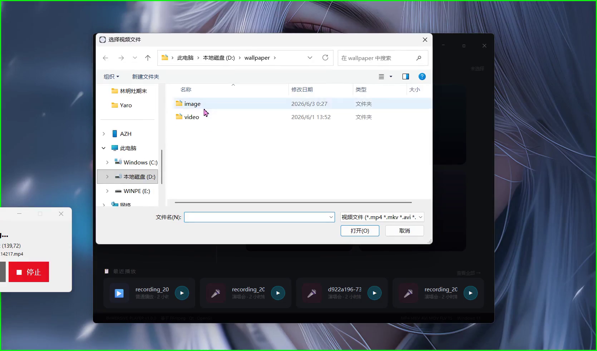

# Immersive Player

> 基于 Qt6 + OpenGL 4.5 + FFmpeg 的沉浸式 3D 视频播放器

将普通视频融入到 3D 场景中播放，提供身临其境的观影体验。支持演唱会、电影院、科技广场等多种沉浸式场景，以及普通播放模式。

<p align="center">
  <a href="EffectDemonstration/test.mp4">
    
  </a>
</p>

---

## 功能特性

### 沉浸式 3D 场景

| 场景 | 描述 |
|------|------|
| **演唱会** | 舞台、动画表演者、灯光立方体、迪斯科球、观众粒子、音箱、移动光束 |
| **电影院** | 影院荧幕、座椅阵列、大厅装饰、氛围粒子、走廊灯带 |
| **科技广场** | 赛博朋克城市广场、能量核心、无人机群、浮动结构、全息屏幕、发光建筑 |
| **普通播放** | 标准视频播放模式，无 3D 场景 |

每个场景均支持：
- 鼠标拖拽旋转视角（轨道摄像机）
- 滚轮缩放
- Phong 光照（点光源、方向光、聚光灯）
- 2048x2048 阴影映射
- 动态场景动画（粒子、浮动物体、光线变化）

### 视频播放

- 基于 FFmpeg 的多线程解码（独立读取线程 + 解码线程）
- 包队列 + 帧队列架构，流畅播放
- 支持本地文件与网络流（RTMP/RTSP/HTTP 等）
- 进度拖动 seek、快进/快退
- 倍速播放（0.5x ~ 4.0x）
- 直播流播放
- 缓冲检测与加载提示

### 音频

- 基于 miniaudio 的低延迟音频渲染
- 无锁环形缓冲区（SPSC），262144 采样点
- 实时 FFT 频谱可视化（128 点 FFT，64 频段频谱）
- 波形显示
- 音量控制与静音

### 用户界面

- **首页**：场景卡片式入口，文件播放列表，历史记录栏
- **播放控制栏**：播放/暂停、上一曲/下一曲、快进/快退、倍速、音量、静音、全屏、波形切换
- **播放列表**：管理当前播放队列
- **历史记录**：最多 20 条播放历史，记录播放场景
- **媒体库**：将文件复制到应用库目录，UUID 去重
- **最近 URL**：最多 10 条网络流地址记录
- 自定义标题栏、加载遮罩、确认对话框

### 开发与调试

- 内置压力测试工具（暂停/播放、变速、Seek、组合操作、文件切换）

---

## 项目结构

```
ImmersivePlayer/
├── CMakeLists.txt              # CMake 构建配置
└── src/
    ├── main.cpp                # 程序入口
    ├── common/
    │   ├── Constants.h         # 颜色、尺寸等常量
    │   └── Types.h             # 枚举与数据结构定义
    ├── core/
    │   ├── VideoManager.h/cpp  # 视频/音频播放总控
    │   └── StressTest.h        # 压力测试工具
    ├── audio/
    │   ├── AudioRenderer.h/cpp # miniaudio 音频渲染器
    │   ├── AudioDecoder.h/cpp  # FFmpeg 音频解码器
    │   ├── AudioVisualizer.h/cpp # FFT 频谱可视化
    │   └── miniaudio.h         # miniaudio 单头文件库
    ├── video/
    │   ├── VideoDecoder.h/cpp  # FFmpeg 视频解码器（多线程）
    │   ├── PacketQueue.h/cpp   # 包队列（读取→解码）
    │   └── FrameQueue.h/cpp    # 帧队列（解码→渲染）
    ├── render/
    │   ├── OpenGLWidget.h/cpp  # OpenGL 渲染控件
    │   ├── Scene.h             # 场景抽象基类
    │   ├── Camera.h/cpp        # 轨道摄像机
    │   ├── ScreenModel.h/cpp   # 视频纹理屏幕模型
    │   ├── MeshUtils.h/cpp     # 基础网格生成工具
    │   ├── RenderTypes.h       # 渲染相关类型定义
    │   └── scenes/
    │       ├── ConcertScene.h/cpp   # 演唱会场景
    │       ├── CinemaScene.h/cpp    # 电影院场景
    │       └── TechPlazaScene.h/cpp  # 科技广场场景
    └── ui/
        ├── MainWindow.h/cpp         # 主窗口（QStackedWidget 页面切换）
        ├── HomePage.h/cpp           # 首页
        ├── NormalPlayerWidget.h/cpp # 普通播放器页面
        ├── ScenePlayerWidget.h/cpp  # 3D 场景播放器页面
        ├── SceneControlPanel.h/cpp  # 播放控制栏
        ├── SessionManager.h/cpp     # 会话管理（历史/媒体库/URL）
        ├── WaveformWidget.h/cpp     # 波形显示控件
        ├── AudioVisualizerPopup.h/cpp # 音频可视化弹窗
        └── widgets/
            ├── TitleBar.h/cpp           # 自定义标题栏
            ├── SceneCard.h/cpp          # 场景卡片
            ├── VideoProgressBar.h/cpp   # 视频进度条
            ├── VolumeSlider.h/cpp       # 音量滑块
            ├── SpeedPopup.h/cpp         # 倍速选择弹窗
            ├── PlaylistPopup.h/cpp      # 播放列表弹窗
            ├── FilePlaylist.h/cpp       # 文件播放列表
            ├── HistoryBar.h/cpp         # 历史记录栏
            ├── HistoryDialog.h/cpp      # 历史记录对话框
            ├── MediaLibraryDialog.h/cpp # 媒体库对话框
            ├── UrlInputDialog.h/cpp     # URL 输入对话框
            ├── LoadingOverlay.h/cpp     # 加载遮罩
            └── ConfirmDialog.h/cpp      # 确认对话框
```

---

## 依赖项

| 依赖 | 用途 |
|------|------|
| **Qt 6** (Widgets, OpenGL, OpenGLWidgets) | UI 框架与 OpenGL 集成 |
| **FFmpeg** (avcodec, avformat, avutil, swscale) | 音视频解码 |
| **GLM** | 数学库（矩阵、向量运算） |
| **Assimp** | 3D 模型导入（预留） |
| **miniaudio** (header-only) | 音频播放 |
| **OpenGL 4.5** | 3D 渲染 |

---

## 构建

### 前置要求

- CMake 3.16+
- C++17 编译器（MSVC 2022+ / GCC 11+ / Clang 14+）
- Qt 6（含 Widgets、OpenGL、OpenGLWidgets 模块）
- FFmpeg 共享库（Windows: `ffmpeg_win64_shared`）
- GLM 头文件
- Assimp 库

### 配置与编译

```bash
# 克隆项目
git clone <repo-url>
cd ImmersivePlayer

# Windows (MSVC) 必须先从开发者命令提示符初始化环境：
#   call "C:\Program Files\Microsoft Visual Studio\2022\Community\VC\Auxiliary\Build\vcvarsall.bat" x64

# 配置（指定各第三方库的独立路径）
cmake -B build \
  -DCMAKE_PREFIX_PATH=/path/to/qt6 \
  -DCMAKE_BUILD_TYPE=Release \
  -DGLM_DIR=/path/to/glm \
  -DASSIMP_DIR=/path/to/assimp \
  -DFFmpeg_DIR=/path/to/ffmpeg

# 编译
cmake --build build
```

### CMake 选项

| 选项 | 说明 |
|------|------|
| `GLM_DIR` | GLM 头文件目录（header-only，无需编译） |
| `ASSIMP_DIR` | Assimp 库根目录（含 `include/`、`lib/`、`bin/`） |
| `FFmpeg_DIR` | FFmpeg 共享库根目录（含 `bin/` 下的 DLL） |
| `CMAKE_PREFIX_PATH` | Qt 6 安装路径 |

构建完成后，Assimp 和 FFmpeg 的 DLL 会自动复制到输出目录。

---

## 快捷键

| 按键 | 功能 |
|------|------|
| `Space` | 播放 / 暂停 |
| `F` | 全屏切换 |
| `Left/Right` | 快退 / 快进 |
| `Esc` | 返回首页 |

---

## 技术亮点

- **多线程解码架构**：读取线程、解码线程、音频喂流线程、渲染线程分离，避免阻塞
- **无锁 SPSC 环形缓冲区**：音频渲染器使用原子操作实现零锁音频数据传递
- **实时 FFT 频谱分析**：128 点 FFT 实时计算，64 频段频谱 + 256 点波形 + 峰值保持
- **Phong 光照模型**：支持点光源、方向光、聚光灯，配合阴影映射实现高质量渲染
- **模块化场景系统**：`Scene` 抽象基类定义统一接口，各场景独立实现，易于扩展